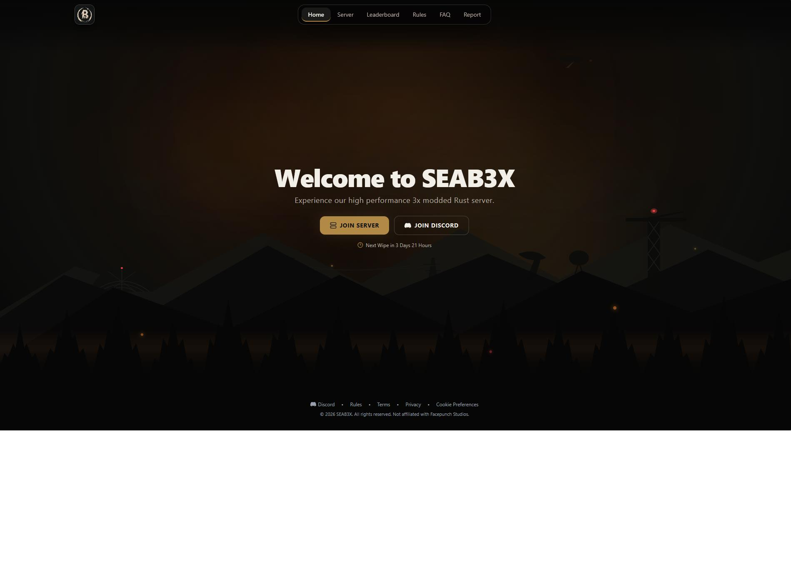
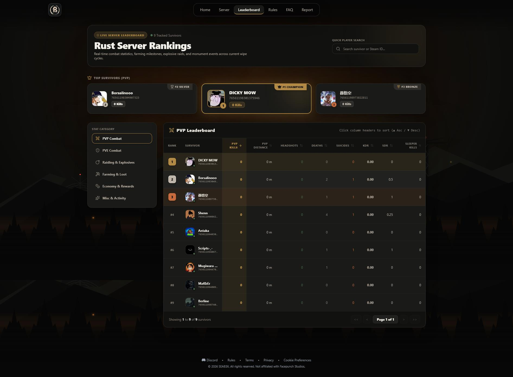

# SEAB3X Rust Server Hub

Real-time statistics, player leaderboards, server status, killfeed, and Steam/Discord account linking for the **[SEA] BEGINNERS 3X** Enardo Rust game servers (Asia region, 3x rates).

The app combines a React 19 + Vite frontend with a TypeScript Express + WebSocket backend, live data from the Rust servers via RCON/query ports, and external integrations (BattleMetrics, Steam Web API, RustMaps) backed by MySQL.

## Features

- **Live server status** — online state, player counts, queue, ping, map info, and wipe schedule (Friday map wipes, first-Friday blueprint wipes) pushed over WebSocket.
- **Real-time killfeed** — kills streamed to the UI with weapon, distance, headshot flag, and player avatars.
- **Player leaderboard** — ranked profiles with PVP, PVE, raiding, farming, economy, and misc stat groups, plus Steam avatar enrichment and player search/autocomplete.
- **Live map heatmap** — kill intensity across map grids from live map data.
- **Store & giveaways** — VIP ranks, kits, queue bypass, skins, and coin packages with perks.
- **Account linking** — Steam and Discord linking for verified player profiles and rewards.
- **Rules, FAQ, and report views** — community-facing pages for the server.
- **Admin API** — token-protected endpoints for integration status checks and server config.

## Tech Stack

- **Frontend:** React 19, Vite 6, TypeScript, Tailwind CSS 4, Lucide React, Motion
- **Backend:** Node.js, Express 4, `ws` WebSocket server, `tsx` (dev) / esbuild bundle (prod)
- **Database:** MySQL (`mysql2` connection pool)
- **Integrations:** BattleMetrics API, Steam Web API, RustMaps API, RCON server queries
- **AI:** Server-side Gemini API (`@google/genai`)

## Getting Started

**Prerequisites:** Node.js 20+ and npm.

```bash
# 1. Install dependencies
npm install

# 2. Create your environment file
cp .env.example .env

# 3. Replace every placeholder in .env with your own credentials
# 4. Start the development server (Express + Vite HMR)
npm run dev
```

Open `http://localhost:3000` (or the `APP_ORIGIN` you set).

## Environment Variables

All variables are documented in [`.env.example`](.env.example). Key ones:

| Variable | Description |
| --- | --- |
| `PORT` | HTTP port for the Node server (default `3000`) |
| `APP_ORIGIN` / `APP_ORIGINS` | Allowed CORS origins, e.g. `https://seab2x.com` |
| `VITE_API_URL` / `VITE_WS_URL` | Frontend-only; override the API/WebSocket base URLs (e.g. the Railway URL) |
| `ADMIN_API_TOKEN` | Long random token required for admin API routes (`Authorization: Bearer <token>`) |
| `RUST_SERVER_IP`, `RUST_GAME_PORT`, `RUST_QUERY_PORT`, `RUST_RCON_PORT`, `RUST_RCON_PASSWORD` | Rust server connection details for status queries and RCON |
| `RUST_WORLD_SEED`, `RUST_WORLD_SIZE`, `BATTLEMETRICS_SERVER_ID` | Map and BattleMetrics metadata |
| `MYSQL_HOST`, `MYSQL_PORT`, `MYSQL_USER`, `MYSQL_PASSWORD`, `MYSQL_DATABASE` | MySQL connection (server-side only) |
| `STEAM_API_KEY` | Steam Web API key for player summaries/avatars |
| `BATTLEMETRICS_API_KEY` | BattleMetrics API key |
| `RUSTMAPS_API_KEY` | RustMaps API key for map info |

## Scripts

| Command | Description |
| --- | --- |
| `npm run dev` | Start the dev server with Vite middleware + HMR (`tsx server.ts`) |
| `npm run build` | Build the client (`vite build`) and bundle the server to `dist/server.cjs` |
| `npm start` | Run the production server (`node dist/server.cjs`) |
| `npm run build:client` | Build only the Vite client (used by Vercel) |
| `npm run preview` | Preview the Vite build |
| `npm run lint` | Type-check with `tsc --noEmit` |

## API Overview

| Endpoint | Description |
| --- | --- |
| `GET /api/health` | Health check |
| `GET /api/servers` | List of Rust servers with live status |
| `GET /api/servers/live-map-info` | Live map metadata |
| `GET /api/killfeed` | Recent kill events |
| `GET /api/leaderboard` | Ranked player leaderboard |
| `GET /api/players/:id` | Single player profile |
| `GET /api/steam/player/:steamId` | Steam player summary |
| `GET /api/battlemetrics/servers` | BattleMetrics server data |
| `GET /api/rustmaps/info` | RustMaps map info for the world seed/size |
| `GET /api/rustmaps/v4-swagger` | RustMaps v4 API spec proxy |
| `GET /api/store` | Store packages |
| `GET /api/giveaways` | Active giveaways |
| `GET /api/integrations/status` | Integration health (**admin token required**) |
| `POST /api/server/config` | Update server config (**admin token required**) |
| `WS /ws` | Real-time WebSocket feed |

### WebSocket Messages

- `INIT_STATS` — initial server stats and latest kill
- `SERVER_UPDATE` — player count / ping updates per server
- `KILL_EVENT` — new killfeed entry
- `LEADERBOARD_UPDATE` — live leaderboard changes

## Project Structure

```text
├── src/                 # React frontend
│   ├── components/      # Views and UI components (Home, Servers, Leaderboard, Store, ...)
│   ├── context/         # WebSocket context
│   ├── config/          # Runtime API/WS URL resolution
│   ├── data/            # Mock/fallback data
│   └── utils/           # Wipe schedule helpers
├── server/
│   └── integrations.ts  # MySQL, RCON, Steam, BattleMetrics, RustMaps clients
├── server.ts            # Express app, API routes, WebSocket server
├── public/              # Static assets (favicon, robots.txt, sitemap.xml)
└── dist/                # Build output (client + server bundle)
```

## Deployment

The frontend is configured for **Vercel** (see [`vercel.json`](vercel.json)) with an SPA rewrite. The Node/Express server (including WebSocket and API routes) can be deployed to any Node host — for example Railway:

```bash
# Build the client + server bundle
npm run build

# Run the production server
npm start
```

In production:

- Set every value from `.env.example` in your hosting provider's secret/environment settings. **Never upload `.env` to a public repository.**
- Set `NODE_ENV=production` and `APP_ORIGIN` to the exact public HTTPS origin (e.g. `https://seab2x.com`).
- If the frontend is hosted separately (Vercel) from the API/WebSocket server, set `VITE_API_URL` and `VITE_WS_URL` to the API origin.
- Use a long random `ADMIN_API_TOKEN`; admin API calls require `Authorization: Bearer <token>`.
- Set `TRUST_PROXY=true` only when the app runs behind a trusted reverse proxy.

## Security Notes

- Never use a `VITE_` prefix for passwords or API keys — Vite exposes variables with that prefix to browser JavaScript.
- Keep secrets server-side only; the frontend never sees MySQL credentials, RCON passwords, or API keys.
- Rotate any credential immediately if it has ever been committed or sent to a browser.
- `app.use(express.json({ limit: '32kb' }))` bounds request body size, and the WebSocket server caps payloads at 1 KB.




